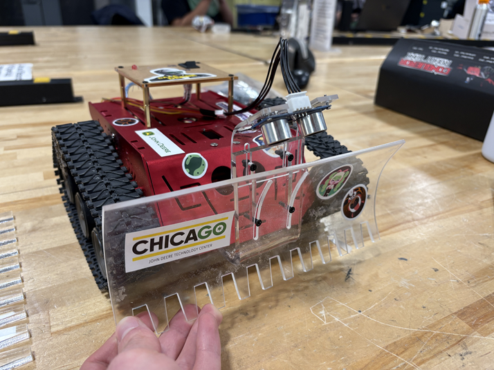

# 🚜 HackIllinois 2026 – Mechaton Track
### Autonomous Surface-Flattening Robot

## 📌 Project Overview

This project was developed for the **HackIllinois 2026 – John Deere Mechaton Track**.

The objective was to design and build a robot capable of:

- Operating **fully autonomously**
- Flattening a surface to a **specified smoothness level**
- Ensuring **safe human interaction**

---

## 👨‍💻 My Contributions

- 🛠 Designed a **mechanical flattening system** targeting controlled smoothness levels  
- ⚡ Rapidly prototyped using **laser cutters and 3D printers**  
- 🔒 Implemented **hardware safety mechanisms** for human interaction  
- 💻 Conducted and reviewed **C++ code implementation**

---

## 🧰 Technical Stack

**Hardware & Fabrication**
- Laser Cutting
- 3D Printing
- Rapid Prototyping

**Software**
- C++
- Embedded Systems Programming

**Electrical**
- Safety circuits
- LED status indicators

---

## 🎥 Demo

### Robot in Action

  

### Final Robot

  

---

## 🏆 Performance Results

| Metric | Score |
|--------|--------|
| Surface Smoothness | **6 / 10** |
| Speed Performance | **8 / 10** |

We couldn't acheive full-autonomy due to the time limit (Partial autonomy).

---

## 📚 Key Takeaways

- Designing **complex mechanical systems under tight deadlines** is extremely challenging  
- Strong **planning and iteration strategy** significantly impacts results  
- Implementing control systems like **PID controllers** requires deeper preparation in constrained environments  

---

## 📄 License

This project follows the license provided in the original repository:

🔗 [ELEGOO-Conqueror-Robot-Tank-Kit License](https://github.com/elegooofficial/ELEGOO-Conqueror-Robot-Tank-Kit/blob/main/Conqueror%20Robot%20Tank%20Kit%203D%20model.zip)